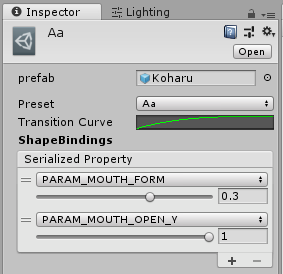

# AniLipSync-live2d

Live2Dでリミテッドアニメのようなリップシンクを実現するためのライブラリです。  
The library that implement LipSync with Live2D like a limited animation.

[AniLipSync](https://github.com/XVI/AniLipSync)の実装がベースになっています。
また、VisemeShapeClipの実装で[UniVRM](https://github.com/dwango/UniVRM)を参考にしています。

## Download

[AniLipSync-live2d v1.0.0](https://github.com/nkjzm/AniLipSync-live2d/releases/download/v1.0.0/AniLipSync-live2d.unitypackage)

## Environment

- Windows 10 / macOS High Sierra
- Unity 2018.2.10f1

## Requirement

- [OVRLipSync Version 1.28.0](https://developer.oculus.com/downloads/package/oculus-lipsync-unity/1.28.0/)
- [Live2d Cubism 3 SDK for Unity R9](https://live2d.github.io/#unity)

各パッケージについてはそれぞれが定めるライセンスに準拠してください。  
Please comply with license defined by each package.

## Samples

`Assets/AniLipSync-live2d/Examples/Scenes/AniLipSync-live2d.unity`

## Getting Stared

1. Open your unity project
1. Import OVRLipSync
1. Import Live2d Cubism 3 SDK for Unity
1. Import AniLipSync-live2d.unitypackage
1. Add prefab, `Assets/Oculus/LipSync/Prefabs/LipSyncInterface` in the scene
1. Add prefab, `Assets/AniLipSync-live2d/Prefabs/AniLipSync-live2d` in the scene
1. Create 5 VisemeShapeClips, `aa`, `E`, `ih`, `oh`, `ou`
1. Set `AnimMorphTarget` component in `AniLipSync-live2d` prefab 

### VisemeShapeClip

// write later

### Reference

Live2Dでアニメ調のリップシンクを実現する『AniLipSync-live2d』の使い方 - Qiita
https://qiita.com/nkjzm/items/b0d283cf8b1f7fdcf91b

【解説】AniLipSync-live2dをモデルに適用する手順の紹介 - YouTube  
https://www.youtube.com/watch?v=2j2KALzretk

## License

This library under [MIT License](LICENSE)

This library is derived from [AniLipSync](https://github.com/XVI/AniLipSync/blob/master/LICENSE)

### NOTE

このライブラリは[Live2D Open Software 使用許諾契約書](http://live2d.com/eula/live2d-open-software-license-agreement_jp.html)の1.5項が定める **「拡張性アプリケーション」** に該当しますが、株式会社Live2Dと個別に連絡を取り、出版許諾契約不要での公開の許可をいただいております。

このライブラリを使用して製作されたアプリケーションが「拡張性アプリケーション」に該当する場合は、出版の際に別途ライセンス契約が必要になります。詳しくは以下のページを参照してください。

[拡張性アプリケーションのリリースライセンスについて](https://www.live2d.com/ja/products/releaselicense/expandable_application)

